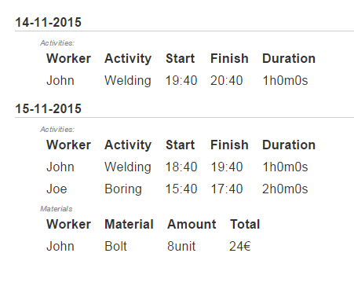

After remotely showing the first prototype to a user, he gave some
feedback and sketched out some other views.


They also said that the "Project Date View" should contain a
place for comments and discussion and that when the project
has fixed pricing, then the `Customer` shouldn't be able to
view how many hours workers worked.

From these views we can deduce several things. First merging
resource use and worker work-time into a single thing isn't
probably a good idea. It will be better if we break it up.


### Adjusting models

<a class="sha" href="https://github.com/loov/timeclock/tree/e165e7904fcad53d98b2f7707f713763372255fa">e165e7904f</a>

One of the things that can be seen that the "sub-project" idea
doesn't figure that much. Maybe we should remove `Task` for now
and later re-add it.

We also split the `Expense` into two separate items:

```go
type Activity struct {
	Worker   string    //TODO: ref
	Date     time.Time // when was the entry made
	Name string
	Start    time.Time
	Finish   time.Time
	Comment  string
}

func (a *Activity) Total() time.Duration {
	return a.Finish.Sub(a.Start)
}

type Material struct {
	Worker   string //TODO: ref
	Date     time.Time
	Resource Resource
	Units    float64
}

func (m *Material) Total() float64 {
	return m.Resource.PPU * m.Units
}
```

One of the things we may notice here is that these things
require some amount of meta-information about the entry.
This means we should remove the common items:

```go
type Event struct {
	Worker string
	Date   time.Time
}

type Activity struct {
	Event
// ...

type Material struct {
	Event
	Resource Resource
// ...
```

We will adjust the server code accordingly.

```go
	example := &project.Project{
		Title:    "Alpha",
		Customer: "ACME",
		Pricing: project.Pricing{
			Hours: 480,
			Price: 1000,
		},
		Description: "Implement views",
		Status:      project.InProgress,
	}

	activites := []*project.Activity{
		{
			Event: project.Event{
				Worker: "John",
				Date:   time.Now(),
			},
			Name:    "Welding",
			Start:   time.Now().Add(-2 * time.Hour),
			Finish:  time.Now().Add(-1 * time.Hour),
			Comment: "A, B, C are done",
		},
		...
	}

	materials := []*project.Material{
		{
			Event: project.Event{
				Worker: "John",
				Date:   time.Now(),
			},
			Resource: project.Resource{ ... },
			Units: 8,
		},
	}

	err = t.Execute(w, map[string]interface{}{
		"Project":    example,
		"Activities": activites,
		"Materials":  materials,
	})
```

One of the things we notice here is that there is a
lot of different pieces moving around. It would be
beneficial to organize all these different items into
a single thing. So we will make a `project.Info`.

```go
type Activities []*Activity
type Materials []*Material

type Info struct {
	Project    Project
	Activities Activities
	Materials  Materials
}
```

From the sketches we also see that we need a grouping by
day, so we will also add:

```go
type DayInfo struct {
	Date       time.Time
	Activities Activities
	Materials  Materials
}

func (info *Info) GroupByDay() []DayInfo {
	// ...
``

Of course we need to update the project view to:



### Many tables

At this point, I'm also thinking whether some sort of abstraction
to allow more easily to describe the tables would be beneficial.
Currently we have several instances of templates:

```html
{{if .Activities}}
<div class="label">Activities:</div>
<table class="activities">
	<thead>
		<tr>
			<th>Worker</th>
			<th>Activity</th>
			<th>Start</th>
			<th>Finish</th>
			<th>Duration</th>
		</tr>
	</thead>
{{range .Activities}}
	<tr>
		<td>{{.Worker}}</td>
		<td>{{.Name}}</td>
		<td>{{.Start.Format "15:04"}}</td>
		<td>{{.Finish.Format "15:04"}}</td>
		<td>{{.Duration}}</td>
	</tr>
{{end}}
</table>
{{end}}
```

Whereas ideally we could do something like:

```html
{{ table .Activities
	"Worker"   .Worker
	"Name"     .Name
	"Start"    (.Start.Format "15:04")
	"Finish"   (.Finish.Format "15:04")
	"Duration" .Duration
}}
```

I'm not sure how to implement it, but it is something to think about.
For now we can implement the tables manually, before finding a way to
implement it. It might be faster to do it manually, until we know
what features will be necessary in that thing.