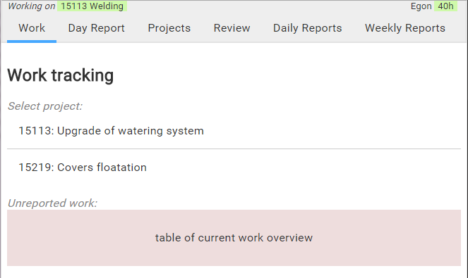
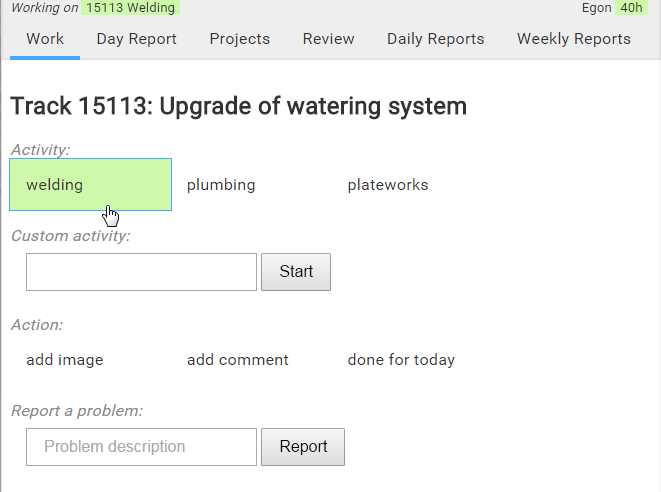
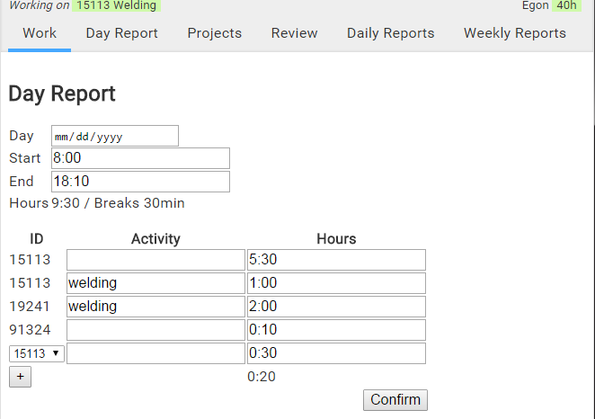
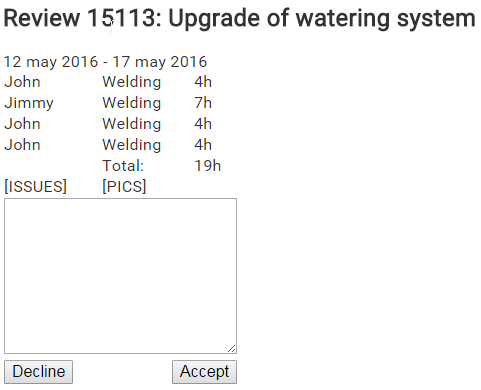

<a class="sha" href="https://github.com/loov/timeclock/tree/014c64ec669407036018948a9ef6e0ebd765a751">014c64ec66</a>

After putting this project on hold, due to other responsibilities.
After few weeks I was finally able to meet with a user behind the same desk.
The end result of that discussion was a significant drop in complexity.

The main thing we got out of the discussion was how the workflow of the worker
will look like and how he will use the system.

When the worker starts his day, he will be presented with a screen
(quite likely on a mobile device):



After selecting a project he chooses the activity he is performing:



There he can submit any additional information such as add an image of the
progress or report some issue (such as some parts were missing or broken).
After completing the task he can either go select another project or
finish his day with a Day Report.



We try to put together the day-report from existing information as much as possible.
We cannot simply actively confirm the work, because sometimes a worker might forget
to start his timeclock or alternatively he may be somewhere, where there is no
internet access. There might also be some adjustments necessary to the hours,
either way, this additional reporting step is necessary.

All those work hours must be reviewed by an engineer, whether they are up to bar,
or whether they took longer than they should. Engineers review projects and
every week, rather than every day:



SIDENOTE: The screen prototypes left out some parts when designing,
because it was easy to imagine them being there, but the exact design
and mock-up wasn't important at that point.

Since all the reviews, whether accepted or declined, need to be processed by
the accounting, there is also a way to view all the pending/accepted/declined
week reviews.


This new approach is much simpler for the workers to work with and easier to implement,
while mostly delivering the same amount or even more value.

The main thing that was removed, was "materials" tracking. It would be inconvenient
to continously track the materials missing and used, it's easier to do that with talking.

One thing that I additionally created was a "notes.txt" file, to track things
that need to be implemented, however not vital at this point. For example, it
contains that there needs to be few statistics pages to get an overview of projects.

### Restart

Now we are going to throw away our initial design because it was too complicated.
You might be thinking:

> Wait, what? This is a book about how to write more efficiently and and get
> things better and now after writing dedicating a chapter on designing
> something we are just going to throw away all of that work?

Let's step back and look at how much we actually have written code:

```
extension  files binary blank code
----------------------------------
go             3      0    41  231
html           1      0     2   91
css            1      0    21   89
```

This is very little code. It can easily be rewritten in a day.
Of course, rewriting code is much easier, which means it will go much quicker
than first time.

This book could have started with the "perfect approach",
but this is what will happen in real-life: you misunderstand people, you find
better ways of doing things and you learn more about the *value* while
writing the project.

Also, it is not wasted effort, the initial design helped to learn about
the project. The analysis part was important, not the code part.
Without this, we may have never been able to improve the user experience.

This is also one of the main reasons for holding off stiffening
(eg. writing tests) for later, until we are convinced that we have
a nice architecture in place for the system to work as a whole.

This doesn't mean every time you find a better way to implement things,
you should rewrite everything.

In this case it didn't make sense to use the previous design.

### Architecture